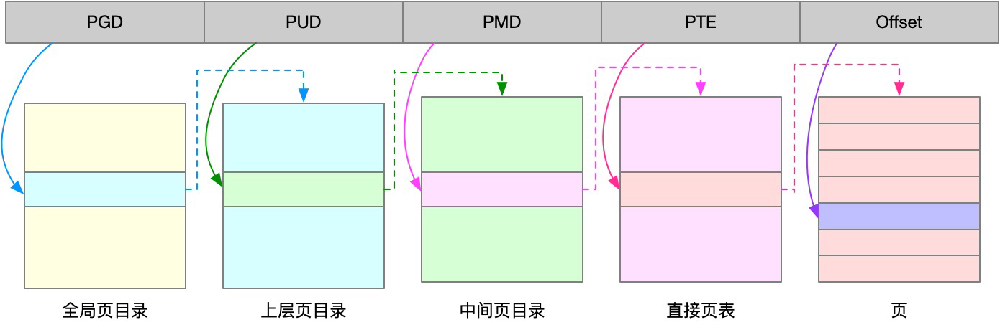
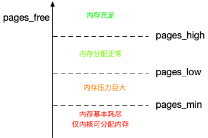
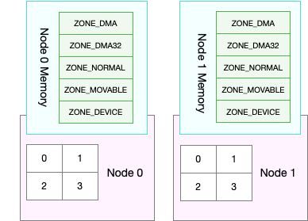
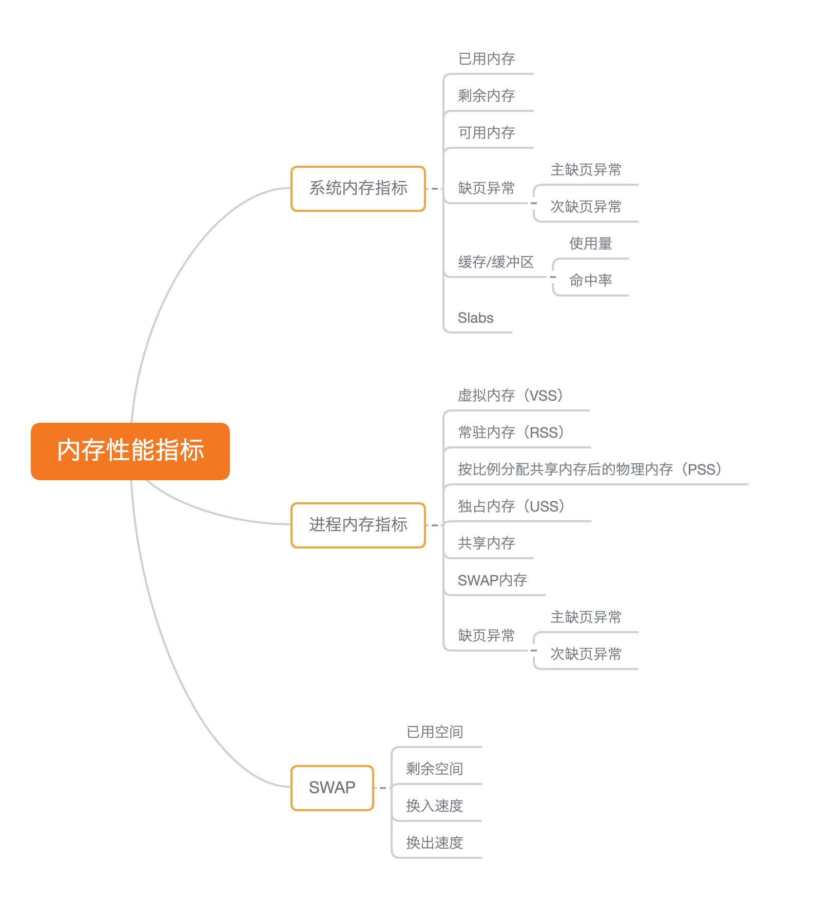
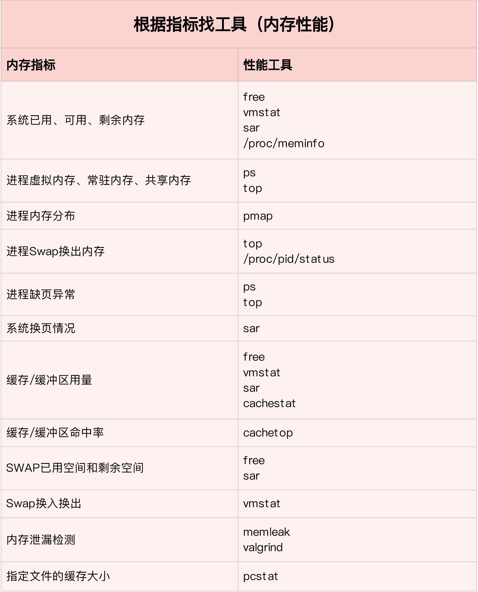
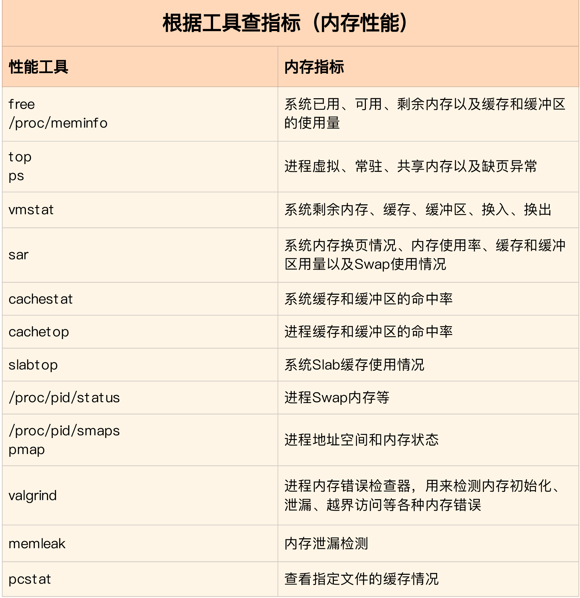
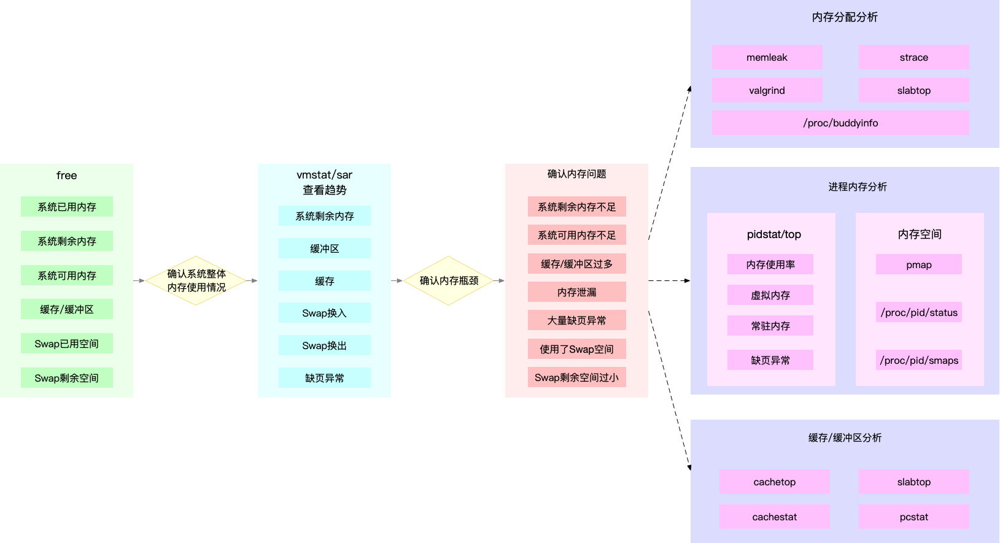

# 内存
## 内存映射

* 内存映射，其实就是将虚拟内存地址映射到物理内存地址。为了完成内存映射，内核为每个进程都维护了一张页表，记录虚拟地址与物理地址的映射关系
* 页表实际上存储在 CPU 的内存管理单元 MMU 中，这样，正常情况下，处理器就可以直接通过硬件，找出要访问的内存。而当进程访问的虚拟地址在页表中查不到时，系统会产生一个缺页异常，进入内核空间分配物理内存、更新进程页表，最后再返回用户空间，恢复进程的运行。
* 为了解决页表项过多的问题，Linux 提供了两种机制，也就是多级页表和大页（HugePage）。
    * 多级页表就是把内存分成区块来管理，将原来的映射关系改成区块索引和区块内的偏移。由于虚拟内存空间通常只用了很少一部分，那么，多级页表就只保存这些使用中的区块，这样就可以大大地减少页表的项数。Linux 用的正是四级页表来管理内存页，如下图所示，虚拟地址被分为 5 个部分，前 4 个表项用于选择页，而最后一个索引表示页内偏移。
    
    * 大页，顾名思义，就是比普通页更大的内存块，常见的大小有 2MB 和 1GB。大页通常用在使用大量内存的进程上，比如 Oracle、DPDK 等。
  
## 内存分配回收

* malloc
        brk() 方式的缓存，可以减少缺页异常的发生，提高内存访问效率。不过，由于这些内存没有归还系统，在内存工作繁忙时，频繁的内存分配和释放会造成内存碎片。
        而 mmap() 方式分配的内存，会在释放时直接归还系统，所以每次 mmap 都会发生缺页异常。在内存工作繁忙时，频繁的内存分配会导致大量的缺页异常，使内核的管理负担增大。这也是 malloc 只对大块内存使用 mmap  的原因。
* 在发现内存紧张时，系统就会通过一系列机制来回收内存，比如下面这三种方式：
        回收缓存，比如使用 LRU（Least Recently Used）算法，回收最近使用最少的内存页面；
        回收不常访问的内存，把不常用的内存通过交换分区直接写到磁盘中；
         杀死进程，内存紧张时系统还会通过 OOM（Out of Memory），直接杀掉占用大量内存的进程。
* 三种方式回收内存
    * 基于 LRU（Least Recently Used）算法，回收缓存；
    * 基于 Swap 机制，回收不常访问的匿名页；
    * 基于 OOM（Out of Memory）机制，杀掉占用大量内存的进程。
* 缓存回收和 Swap 回收，实际上都是基于 LRU 算法，也就是优先回收不常访问的内存。LRU 回收算法，实际上维护着 active 和 inactive 两个双向链表，其中：
    * active 记录活跃的内存页；
    * inactive 记录非活跃的内存页。
    * 越接近链表尾部，就表示内存页越不常访问。这样，在回收内存时，系统就可以根据活跃程度，优先回收不活跃的内存。
    * 活跃和非活跃的内存页，按照类型的不同，又分别分为文件页和匿名页，对应着缓存回收和 Swap 回收。
* OOM 是内核的一种保护机制。它监控进程的内存使用情况，并且使用 oom_score 为每个进程的内存使用情况进行评分：一个进程消耗的内存越大，oom_score 就越大；一个进程运行占用的 CPU 越多，oom_score 就越小。触发的时机基于虚拟内存。进程在申请内存时，如果申请的虚拟内存加上服务器实际已用的内存之和，比总的物理内存还大，就会触发 OOM。

## buffer,cache

* Buffers 是对原始磁盘块的临时存储，也就是用来缓存磁盘的数据，通常不会特别大（20MB 左右）。这样，内核就可以把分散的写集中起来，统一优化磁盘的写入，比如可以把多次小的写合并成单次大的写等等。
* Cached 是从磁盘读取文件的页缓存，也就是用来缓存从文件读取的数据。这样，下次访问这些文件数据时，就可以直接从内存中快速获取，而不需要再次访问缓慢的磁盘。
* SReclaimable 是 Slab 的一部分。Slab 包括两部分，其中的可回收部分，用 SReclaimable 记录；而不可回收部分，用 SUnreclaim 记录。
  
Buffer 是对磁盘数据的缓存，而 Cache 是文件数据的缓存，它们既会用在读请求中，也会用在写请求中,读文件时只有cache增加，读磁盘时buffer比cache增加快很多，写也是类似
一个文件读首先到Block Buffer, 然后到Page Cache。有了文件系统才有了Page Cache.在老的Linux上这两个Cache是分开的。那这样对于文件数据，会被Cache两次。这种方案虽然简单，但低效。后期Linux把这两个Cache统一了。对于文件，Page Cache指向Block Buffer，对于非文件则是Block Buffer。这样就如文件实验的结果，文件操作，只影响Page Cache，Raw操作，则只影响Buffer. 比如一此VM虚拟机，则会越过File System，只接操作 Disk, 常说的Direct IO.

## 查看内存使用
free

    # 注意不同版本的free输出可能会有所不同
    $ free
                total        used        free      shared  buff/cache   available
    Mem:        8169348      263524     6875352         668     1030472     7611064
    Swap:             0           0           0

* 第一列，total 是总内存大小；
* 第二列，used 是已使用内存的大小，包含了共享内存；
* 第三列，free 是未使用内存的大小；
* 第四列，shared 是共享内存的大小；
* 第五列，buff/cache 是缓存和缓冲区的大小；
* 最后一列，available 是新进程可用内存的大小。

* VIRT 是进程虚拟内存的大小，只要是进程申请过的内存，即便还没有真正分配物理内存，也会计算在内。
* RES 是常驻内存的大小，也就是进程实际使用的物理内存大小，但不包括 Swap 和共享内存。
* SHR 是共享内存的大小，比如与其他进程共同使用的共享内存、加载的动态链接库以及程序的代码段等。
* %MEM 是进程使用物理内存占系统总内存的百分比。
  
top

    # 按下M切换到内存排序
    $ top
    ...
    KiB Mem :  8169348 total,  6871440 free,   267096 used,  1030812 buff/cache
    KiB Swap:        0 total,        0 free,        0 used.  7607492 avail Mem

    PID USER      PR  NI    VIRT    RES    SHR S  %CPU %MEM     TIME+ COMMAND
    430 root      19  -1  122360  35588  23748 S   0.0  0.4   0:32.17 systemd-journal
    1075 root      20   0  771860  22744  11368 S   0.0  0.3   0:38.89 snapd
    1048 root      20   0  170904  17292   9488 S   0.0  0.2   0:00.24 networkd-dispat
        1 root      20   0   78020   9156   6644 S   0.0  0.1   0:22.92 systemd
    12376 azure     20   0   76632   7456   6420 S   0.0  0.1   0:00.01 systemd
    12374 root      20   0  107984   7312   6304 S   0.0  0.1   0:00.00 sshd
    ...

* VIRT 是进程虚拟内存的大小，只要是进程申请过的内存，即便还没有真正分配物理内存，也会计算在内。
* RES 是常驻内存的大小，也就是进程实际使用的物理内存大小，但不包括 Swap 和共享内存。
* SHR 是共享内存的大小，比如与其他进程共同使用的共享内存、加载的动态链接库以及程序的代码段等。
* %MEM 是进程使用物理内存占系统总内存的百分比。
  
* 第一，虚拟内存通常并不会全部分配物理内存。从上面的输出，你可以发现每个进程的虚拟内存都比常驻内存大得多。
* 第二，共享内存 SHR 并不一定是共享的，比方说，程序的代码段、非共享的动态链接库，也都算在 SHR 里。当然，SHR 也包括了进程间真正共享的内存。所以在计算多个进程的内存使用时，不要把所有进程的 SHR 直接相加得出结果。

### 缓存命中
cachestat 提供了整个系统缓存的读写命中情况。

    $ cachestat 1 3
    TOTAL   MISSES     HITS  DIRTIES   BUFFERS_MB  CACHED_MB
        2        0        2        1           17        279
        2        0        2        1           17        279
        2        0        2        1           17        279 
* TOTAL ，表示总的 I/O 次数；
* MISSES ，表示缓存未命中的次数；
* HITS ，表示缓存命中的次数；
* DIRTIES， 表示新增到缓存中的脏页数；
* BUFFERS_MB 表示 Buffers 的大小，以 MB 为单位；
* CACHED_MB 表示 Cache 的大小，以 MB 为单位。
  
cachetop 提供了每个进程的缓存命中情况。

    $ cachetop
    16:39:18 Buffers MB: 73 / Cached MB: 281 / Sort: HITS / Order: ascending
    PID      UID      CMD              HITS     MISSES   DIRTIES  READ_HIT%  WRITE_HIT%
    21881 root     app                  1024        0        0     100.0%       0.0% 

READ_HIT 和 WRITE_HIT ，分别表示读和写的缓存命中率

缓存都命中了，读取速度也有可能慢，要看每次读取数据的大小

pcstat

    $ pcstat /bin/ls
    +---------+----------------+------------+-----------+---------+
    | Name    | Size (bytes)   | Pages      | Cached    | Percent |
    |---------+----------------+------------+-----------+---------|
    | /bin/ls | 133792         | 33         | 0         | 000.000 |
    +---------+----------------+------------+-----------+---------+

## 内存泄露

vmstat

    # 每隔3秒输出一组数据
    $ vmstat 3
    procs -----------memory---------- ---swap-- -----io---- -system-- ------cpu-----
    r  b   swpd   free   buff  cache   si   so    bi    bo   in   cs us sy id wa st
    procs -----------memory---------- ---swap-- -----io---- -system-- ------cpu-----
    r  b   swpd   free   buff  cache   si   so    bi    bo   in   cs us sy id wa st
    0  0      0 6601824  97620 1098784    0    0     0     0   62  322  0  0 100  0  0
    0  0      0 6601700  97620 1098788    0    0     0     0   57  251  0  0 100  0  0
    0  0      0 6601320  97620 1098788    0    0     0     3   52  306  0  0 100  0  0
    0  0      0 6601452  97628 1098788    0    0     0    27   63  326  0  0 100  0  0
    2  0      0 6601328  97628 1098788    0    0     0    44   52  299  0  0 100  0  0
    0  0      0 6601080  97628 1098792    0    0     0     0   56  285  0  0 100  0  0 

memleak

    $ /usr/share/bcc/tools/memleak -p $(pidof app) -a
    Attaching to pid 12512, Ctrl+C to quit.
    [03:00:41] Top 10 stacks with outstanding allocations:
        addr = 7f8f70863220 size = 8192
        addr = 7f8f70861210 size = 8192
        addr = 7f8f7085b1e0 size = 8192
        addr = 7f8f7085f200 size = 8192
        addr = 7f8f7085d1f0 size = 8192
        40960 bytes in 5 allocations from stack
            fibonacci+0x1f [app]
            child+0x4f [app]
            start_thread+0xdb [libpthread-2.27.so] 

## Swap
Linux 通过直接内存回收和定期扫描的方式，来释放文件页和匿名页，以便把内存分配给更需要的进程使用。专门的内核线程用来定期回收内存，也就是 kswapd0。kswapd0 定义了三个内存阈值（watermark，也称为水位），分别是页最小阈值（pages_min）、页低阈值（pages_low）和页高阈值（pages_high）。剩余内存，则使用 pages_free 表示。

剩余内存小于页最小阈值，说明进程可用内存都耗尽了，只有内核才可以分配内存。剩余内存落在页最小阈值和页低阈值中间，说明内存压力比较大，剩余内存不多了。这时 kswapd0 会执行内存回收，直到剩余内存大于高阈值为止。剩余内存落在页低阈值和页高阈值中间，说明内存有一定压力，但还可以满足新内存请求。剩余内存大于页高阈值，说明剩余内存比较多，没有内存压力。一旦剩余内存小于页低阈值，就会触发内存的回收。这个页低阈值，可以通过内核选项 /proc/sys/vm/min_free_kbytes 来间接设置

swappiness
* 文件页的回收比较容易理解，直接清空，或者把脏数据写回磁盘后再释放。
* 而对匿名页的回收，需要通过 Swap 换出到磁盘中，下次访问时，再从磁盘换入到内存中。设置 /proc/sys/vm/swappiness，来调整文件页和匿名页的回收倾向。swappiness 的范围是 0-100，数值越大，越积极使用 Swap，也就是更倾向于回收匿名页；数值越小，越消极使用 Swap，也就是更倾向于回收文件页。

NUMA
处理器的 NUMA （Non-Uniform Memory Access）架构,在 NUMA 架构下，多个处理器被划分到不同 Node 上，且每个 Node 都拥有自己的本地内存空间。而同一个 Node 内部的内存空间，实际上又可以进一步分为不同的内存域（Zone），比如直接内存访问区（DMA）、普通内存区（NORMAL）、伪内存区（MOVABLE）等

    $ numactl --hardware
    available: 1 nodes (0)
    node 0 cpus: 0 1
    node 0 size: 7977 MB
    node 0 free: 4416 MB
    ...

    $ cat /proc/zoneinfo
    ...
    Node 0, zone   Normal
    pages free     227894
        min      14896
        low      18620
        high     22344
    ...
        nr_free_pages 227894
        nr_zone_inactive_anon 11082
        nr_zone_active_anon 14024
        nr_zone_inactive_file 539024
        nr_zone_active_file 923986
    ...
* nr_zone_active_anon 和 nr_zone_inactive_anon，分别是活跃和非活跃的匿名页数。
* nr_zone_active_file 和 nr_zone_inactive_file，分别是活跃和非活跃的文件页数。

## 内存性能指标

