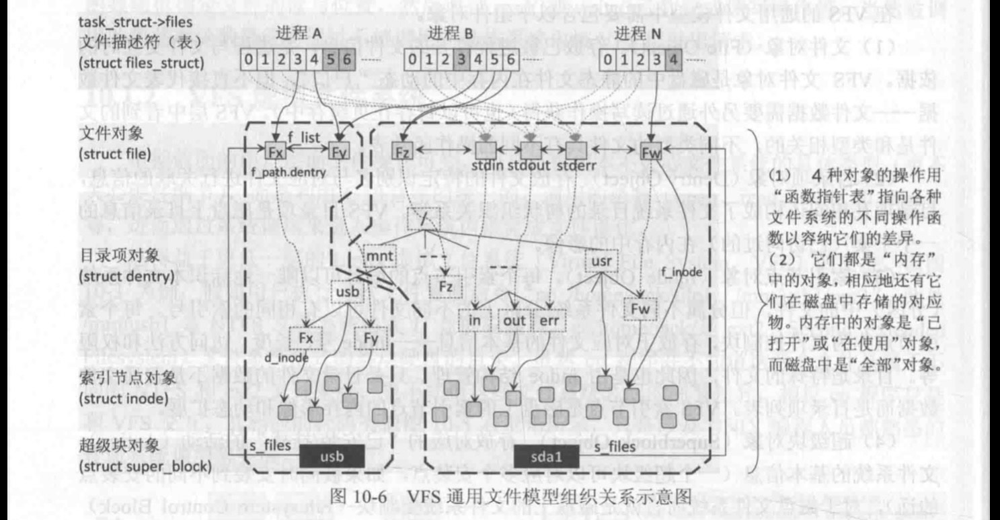
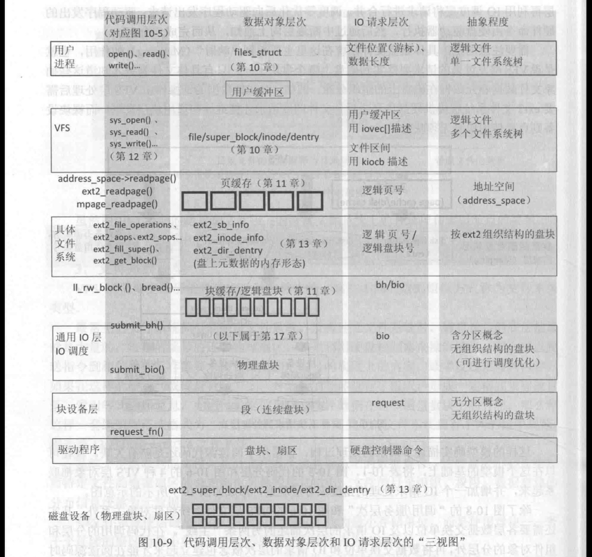
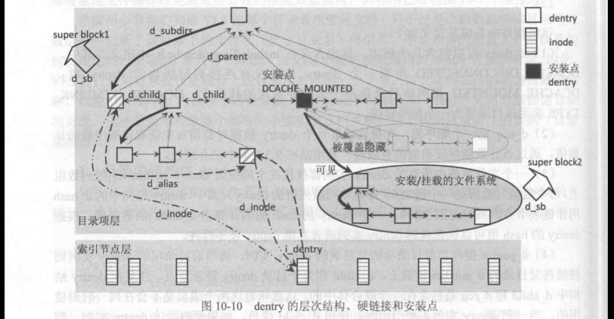
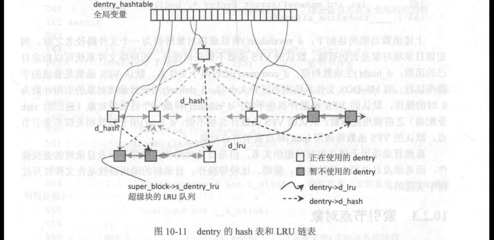
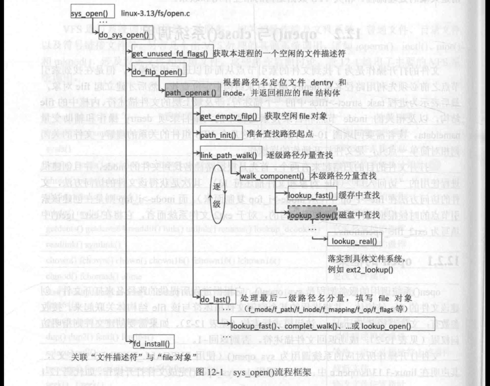
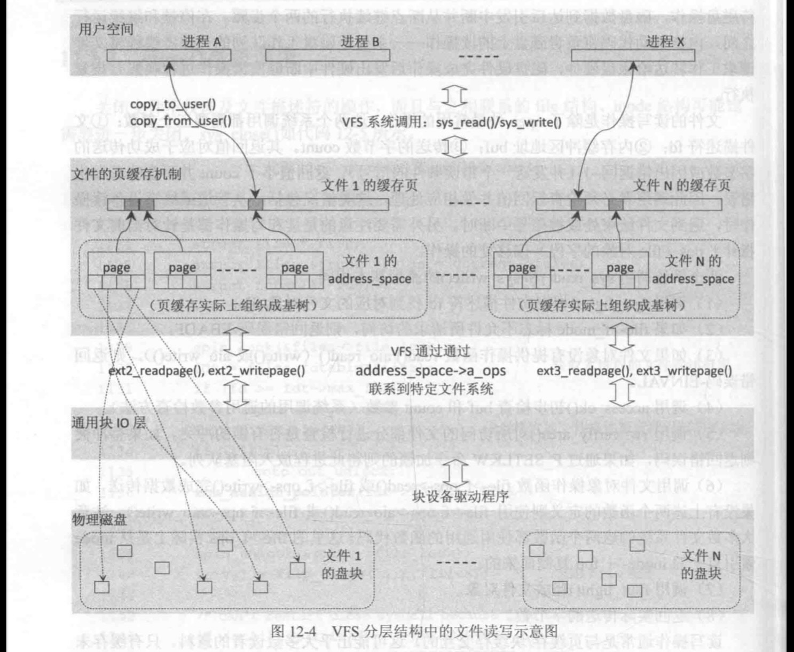
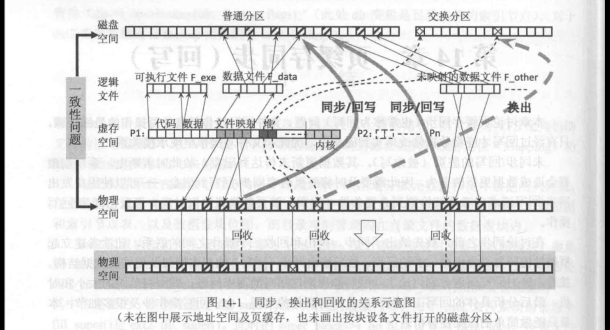

# 文件系统

## 通用文件模型
Linux 的 VFS 层屏蔽底层文件系统细节，对整个文件系统进行了合理的抽象，提取了通用文件模型
无论各种具体的文件系统细节如何，都设法提供与这个通用模型相同的数据对象和相应的操作行为。具体实现上，先通过公共的数据结构和操作函数形式向上提供统一的服务视图，然后利用“西数指针表〞和“联合体”数据结构的方法封装底层的细节差异。
在VFS 的通用文件模型中需要包含以下组件对象。
(1） 文件对象(File Object)。存放已被进程打开的文件信息，是进程与文件交互时的依据。VFS 文件对象是磁盘中的静态文件在内存中的动态“户口”，但不直接代表文件数据文件数据需要另外通过读写操作获得(也可以暂存在页缓存中)。VFS 层中看到的文件是和类型相关的，不同类型的文件具有不同的操作函数表。

(2）日录项对象(Dentry Object)。存放文件的特定识别名与对应文件进行关联的信息，目录项互相间还构成了文件系统目录的树状组织关系等。VFS 目录项是磁盘上目录信息的个子集（己访问过的）在内存中的影像。

（3）索引节点对象(Inode 0bject)。每个索引节点的编号可以唯一地标识本文件系统（分区）中的文件，但分属不同文件系统/分区上的不同文件可以有相同的索引号。每个索引节点作为文件控制块，存放了对应文件的基本信息inode 号、长度、访问方法和权限等。目录是特殊的文件，因此也是由 indoe 结构管理，只是目录文件的数据不是普通文件数据而是目录项列表。VFS 索引节点是磁盘上的索引节点的内存影像和动态扩展。

（4）超级块对象(Superblock Object)。存放对应的“己安装/挂载”的活动 (Active)文件系统的基本信息（一个超级块可以对应多个安装点，如果被同时安装到不同的安装点的话），对于磁盘文件系统而言就是磁盘上的文件系统控制块 (Filesystem Control Block)或超级块（Super Block）的静态信息加上少量动态管理信息。是磁盘上的超级块在内存中的影像和动态扩展。  

* 索引节点 inode 唯一地代表文件：
* 目录项 dentry 将文件组织成目录树状结构，否则文件只能在一维空间上编号访问：
* 文件对象 file 是进程访问文件的接口及现场（游标及打开模式）：
* 超级块 super block则记录了整个文件系统全局性的信息。特别是不要被 file 对象的名字所迷惑，它离真正的文件含义距离较远（见图10-6），大多数情况下 inode 对象反而是本章术语“文件”所指代的内容。因此，对“文件” 词，读者需要在阅读时根据当时讨论的主题而明确其含义。

VFS 通用文件模型的4 种组件对象都是在内存中动态管理的对象，对应于磁盘上相应对象的子集也就是说，对某一具体文件系统类型而言它们还会有磁盘形态

## 操作

### 打开关闭

open0系统调用的服务例程是sys open0，它根据进程所提供的路径名来打开文件，创建该文件的 file 结构体，并将进程的某个空闲文件描述符与该 file 结构体关联起来。接收参数有：文件路径名 filename、访问模式标志位（见表 12-2）、如果需要创建文件则指明访问权限（见表12-2)。成功返回文件描述符，否则返回-1。

### 读写

address space 的页缓冲中。如果找到缓存，则可以通过 copy\_ to user0或 copy\_ from\_ user完成用户缓冲区到页缓存的数据复制从而完成读写操作，见图12-4。如果不在页缓冲中，则需要启动块设备完成相应的读写。
如果页缓存上不能完成操作，则在 VFS 层和特定文件系统层处理完毕后，将形成块设备的请求转向到更底层的块设备层，块设备的请求按照磁盘（或分区）来管理，每个磁盘gendisk->queue（参见17.2.1 节及代码 17-1）将管理这些10 请求队列。

### 同步（回写）、换出和回收

三个操作都是以页帧为单位，且与磁盘文件操作紧密联系。

在Linux 中物理页帧有很大一部分和磁盘紧密联系：例如一些页帧不仅数据来自文件，而且在必要时还可以写回到磁盘相应的文件中.这样的页帧称为页缓存(已在第 11 章详细讨论)：另一种非文件映射的页帧(例如进程堆、栈和匿名映射区）则可以通过交换暂存到交换分区（或交换文件）中虽然写到磁盘文件中和写到交换分区上的操作都需要将页帧内容写回到磁盘上，但前者称为同步(Synchronization)，后者称为交换（Swapping） 中的换出。同步、交换都与回收相关，初学者请理清同步 （回写)、交换和回收操作之间的区别和联系，三者的关系如图14-1 所示。
“同步”一词注重的是一致性问题让页缓存与磁盘文件内容相同，而“回写”一词注重的是保证它们内容一致的具体方法
-用页缓存中被修改过的页帧内容去更新磁盘文件的内容。只要是被访问过的文件数据就有可能成为页缓存，无论是通过 mmapO映射到进程空间的方式还是用 openO打开后进行读写而访问，这些数据暂存在称为页缓存的物理页帧中。在图14-1 中展示了有文件映射的和无文件映射的两种页缓存。图14-1中P1进程创建时从F exe 可执行文件映射了代码段和数据段（由于这些内容不会被改写、无须同步），
进程P1还通过 mmapo映射了 F data 的部分内容。图14-1中还有通过 openo打开而没有映射到任何进程空间的 F other，它也因被访问后进入页缓存而占用物理页帧。这几个文件的部分内容己经读入到页缓存中，这时这些文件数据存在页缓存和盘上两个备份。在第 12章的分析可知，文件的写操作往往只需要修改页缓存中的内容即可返回，因此会出现页缓存和盘上数据不一致的可能。通过同步（回写）操作才能保证盘上数据和内存（物理页帧）中缓存的数据相同。

交换（含换出和换入）中的换出是回收的一个步骤，仅针对无文件映射的可回收页帧(例如图 14-1 中进程 P1的堆区)。图14-1中进程 P1进程虚存空间的堆区虽然占用了物理页帧，但是它与磁盘文件没有直接联系（不是页缓存)。类似地，动态分配的内存空间上存储的内容也与磁盘文件没有直接联系。如果在物理内存紧缺而需要回收物理页帧的时候，它们的内容可以通过换出操作暂时保存到交换分区（图14-1右上角所示）中，但是它们在交换分区中没有固定位置。所以要回收进程 P1 的堆区所占用的页帧时，将它们保存到交换分区并记录它们所在位置（图中向上的细虚线箭头表示）。如果这些内容需要再次访问，则可以通过缺页操作换入其内容。

回收操作则是涉及物理页帧使用的问题，将可回收页解除使用者的页表映射并将页帧另作他用。图14-1 中画出了两个脏页（页缓存）的同步操作（灰色粗实线箭头），脏页需要经同步后才可以回收到 buddy 系统以备后用 （有映射的页帧还需要解除页表映射)。图 14-1 还给出了换出操作（灰色粗虛线箭头），换出后的页帧也可以回收再利用。被换出后，并不是所有页都立刻回收再用，还可能处于中间状态（一种缓冲状态，需要时可快速恢复原来的用途)。图14-1底部两行展示了回收前/后物理页帧的使用情况。同步和换出虽然比较接近，但是它们的区别也是明显的。

(1）同步时所涉及的页缓存在磁盘上的位置是固定的，可以通过文件偏移计算得出而换出涉及的是匿名页，换出到交换空间的位置是不定的（因此需要在页表中记录换出位置，作为再次换入时的依据）。

(2）如果页缓存的内容未做修改和文件内容一致，那么同步时不需要做任何操作，反之如果做了修改则需要写回到磁盘相应位置，此回写操作也称为刷出 （Flushing)。交换页因为没有文件与它对应，因此暂存到交换分区时必须通过写磁盘操作。

(3）页缓存的后备存储器是相应的文件，它们由各自文件所对应的 address space 所管理;匿名页交换时换出的后备存储器为交换分区或交换文件，所有的交换空间和交换缓存则由同一个address space 管理。

(4）文件内容将持久保存，而交换空间（交换分区〕在系统关闭后清除。

匿名页写到交换分区是换出操作，而文件页写回到磁盘不叫作换出而称为同步或回写

