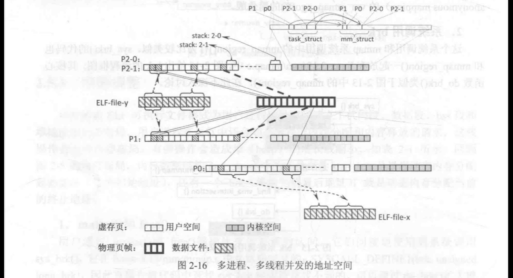
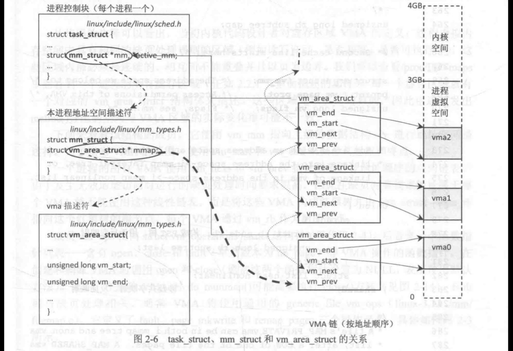
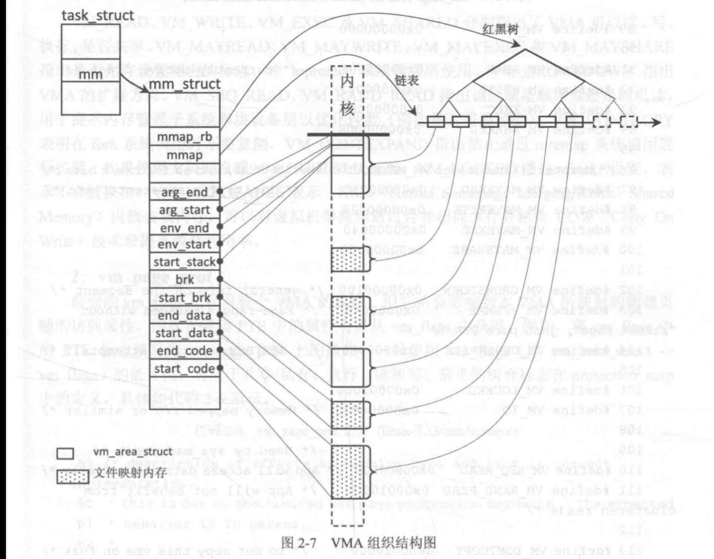
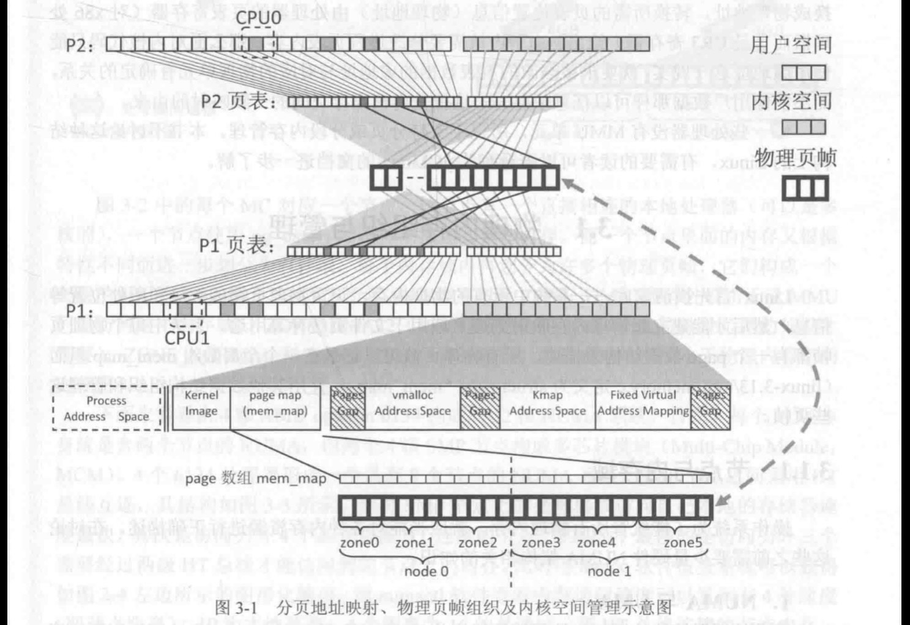
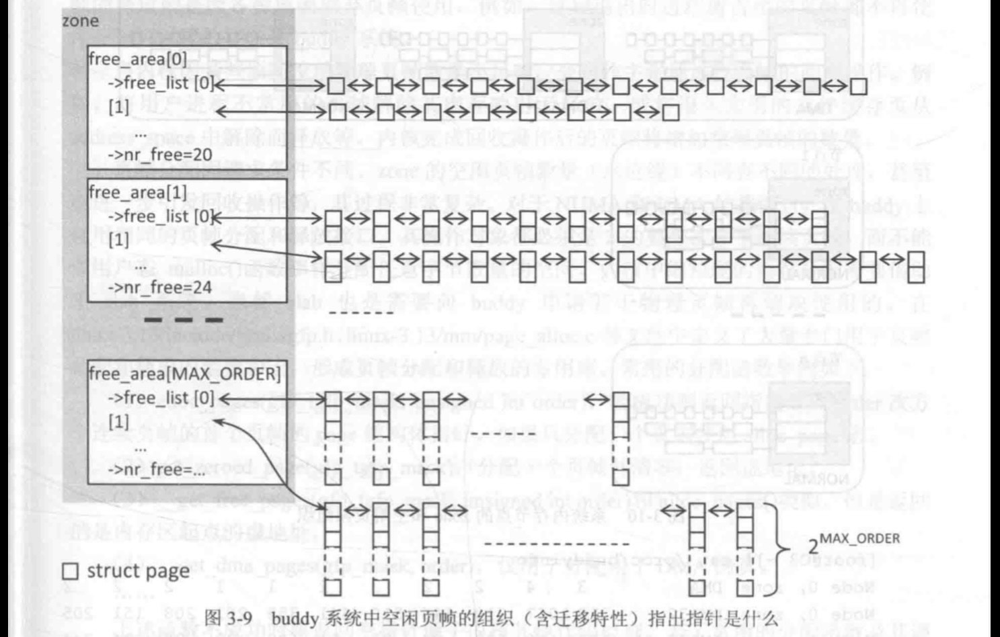
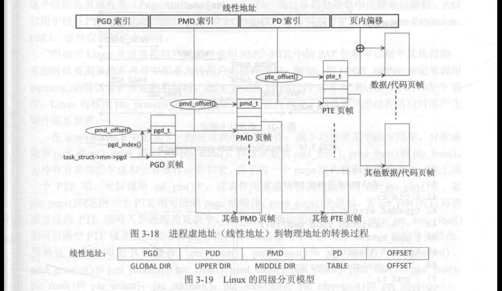
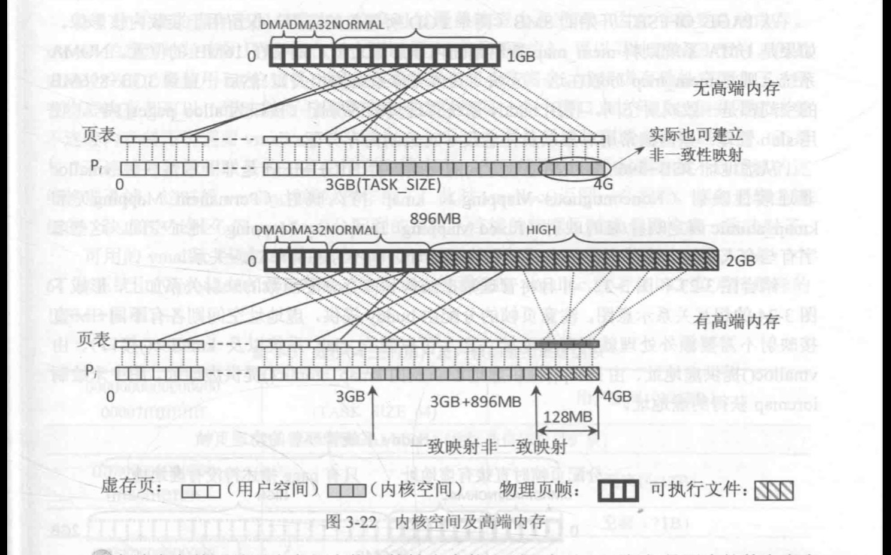
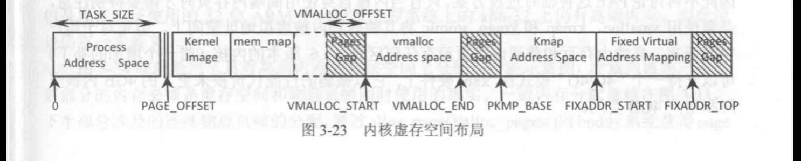
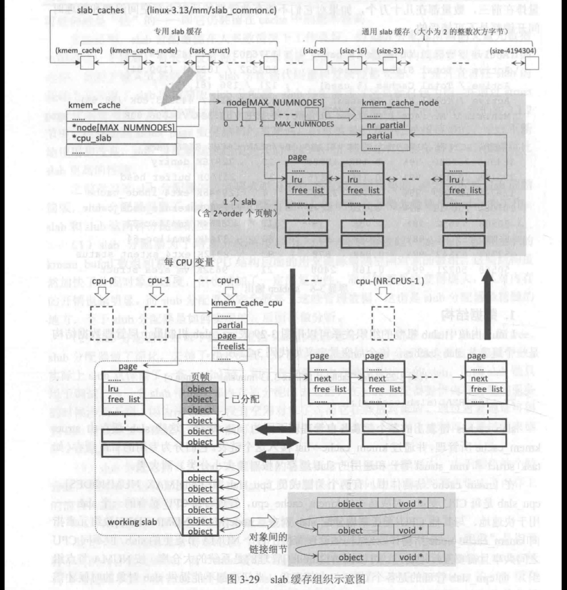

# 进程地址空间
由 ELF-fle-x 可执行程序创建的进程 P0，以及 ELF-file-y 可执行程序创建 PI 和P2，其中P2 共有两个线程。可以看出 PO 的虚存空间是完全独立的，而P1和P2进程的虛存空间量然独立，但是由于映射了相同的 ELF-file-y 代码段和部分数据段（细实线)，因此它们的一些虚存页面映射到了相同的物理页帧上，只有可写数据各自有不同的物理映射（粗虚线）。而P2进程的两个线程P2-0 和 P2-1 则共享一个空间、共用一套页表，但是各自有不同的线程堆栈（除了主线程外，其他线程的栈建立在进程的堆空间上），默认为 8MB（可以调整）。
每个进程或线程在内核空间中都会有自己的进程控制块 task struct，因此在图2-16的右上角绘制了内核空间里的各个进程自己的 task struct 示意图。但是只有进程才会有独立的内存空间，即用mm struct 描述的进程内存布局和相应的页表，因此P2-0 和P2-1 共享同一个m struct。它们虽然有独立的 task struct，但双方的task struct 的mm 成员指向同一个内存描述符。由于各个进程的内核空间是一样的，因此没必要在每个进程的内核空间范围内反复标注相同的上述内容。需要注意各个进程的内核空间部分是相同的，因此任何个进程进入它的内核空间，都可以访问到其他进程的进程控制块 task struct 和内存描述符mm struct， 图2-16 只在一个进程的内核空间做了描绘。由于这些数据结构比起页的尺寸来说很小，因此图中只用一根竖线表示所占用的空间，

## VMA
在 Linux 中各个虚存区域 VMA(对应 ELF 可执行文件的段）是使用 vm area struct结构体来描述的，因此 VMA 是虚存管理的基础性的核心数据结构，VMA 作为内核数据存放在内核空间，与用户空问无关（参见图 2-4)。一个进程的所有虛存数据段 VMA 使用next、vm prev 指针按照地址递增的顺序形成双向链表（早期内核使用 vm next 指针形成单向链表），并且由进程控制块 task struct 结构中的mm struct 结构体的mmap 指针管理，其逻辑关系如图2-6所示，

VMA 组织结构一览由前面的分析可知，VMA 区域是按照两种方式组织的-线性链表和红黑树（如
图2-7所示），按地址递增的线性链表用于内存分配和回收管理，而红黑树用于快速查找某个个虚地址是否落在某个 VMA 区间内。其中，mm struct 结构不仅利用 start code、end code、start data.end data. start brk, brk, start stack, arg start, arg end, env start fll env end在虚存空间界定出这些用途同的“段”各自的范围，而且利用数量众多的 VMA 来描述里面“访存特性”各不相同的连续内存  

全部物理页帧按照节点（node）和内存域（zone）的两级组织形式节点是 NUMA 架构中的术语，指同一个内存控制器 (Memory Controller）所管理的物理地址范围。
一个节点内部的物理内存再根据特性差异分成不同的内存域。物理页帧可以用于映射到进程虚页、映射到内核虚存空间或用于页高速缓存等，未使用的空闲物理页帧用Buddy 系统进行有效的分配和回收管理。

## 物理内存组织与管理
空闲页帧的组织

buddy 系统不仅记录了空闲的物理页帧，而且将这些页帧按连续区间的大小进行组织由于该方法的简单高效，近四十年来没有什么改变，即使在内核 3.13 中仍继续发挥作用。回顾前面内存域zone->free areaTMAX ORDER\]，它将按照空闲区间大小（2的order 次方个连续页帧）进行分阶管理。对于每一种尺寸（阶，order）的连续空闲区间使用zone->free area order\]链表来管理，zone 的成员free area 数组的元素为同名的free area 结构体，

虽然我们在图 3-1 绘制虚页到物理页帧的转换时只通过一级页表就完成了，但实际上由于进程的逻辑空间很大（232 或 264)，采用一级页表需要很大的连续内存空间来存放页表，为了能离散地存放页表以及节约未使用的页表项空间，实际上通常采用多级页表技术，Linux 采用了一种与体系结构无关的三层页表机制--全局页目录 (Page GlobalDirectory， PGD）、中间页目录 （Page Middle Directory,PMD）和页目录 (Page Directory,PD)，保存数据的页和保存页表项的物理页在管理上没有什么区别。

PGD 表中的每一项各自指向一个物理页帧该页帧称为 PMD，包含多个pmdt 类
型的页中间目录 PMD 表项。每个PMD 项各自指向一个物理页帧-该页帧称为 PD，每个PD包含多个ptet类型的页表项 (Page Table Entries, PTE)。每个 PTE 通常最终指向一个用于保存数据或代码的物理页帧，当 PTE 无效时需要额外信息指出从磁盘什么位置可以读到该页内容
- 文件映射页是通过相应 VMA 的vm area struct->vm file 指出所在磁盘文件，而盛名页换出后则在 PTE 中保存换出位置（见图15-16）。于是，每一个线性地址都分成几个部分，分别是 PGD 索引号、PMD素引1号、PTE 索引号以及页内偏移，其逻辑关系如图3-18所示。  

一致映射与高端内存

各个进程通过启用各自的页表从而获得各自的虚存空间，但是一旦涉及内核空间地址范围，所有进程的该部分页表都呈现出相同的映射情况。从另一个角度上看，在内核虛存空间到物理地址的映射上，两者永远只相差一个常数：
-用虛地址减去 TASK SZIE 就是物理地址，反之亦然。对于一致映射，可以使用\_ pa0和\_va0对内核虚地址和物理地址直接转换，无须查看页表。一致映射也称为线性映射 (Linear Mapping) 或直接映射(Directly Mapped).
在图3-22 的上半部展示的是物理内存空间(图中为 1GB）不大于内核虛存空间《图中为 1GB）时的映射关系，每一个页帧都和内核虚页建立起一致映射。但由于 32 位系统内核虚存空间总量只有 1GB，因此在拥有超过 1GB 的物理内存时，也只有 1GB 的物理页帧可以和内核空间的虚页建立起一致映射，这种情况如图 3-22 的下半部分所示。对于物理空间过大的情况，Linux 在内核虚存空间的低 896MB 仍保持一致映射，但是在内核虛存高端部分特别划分了 128MB 空间，这128MB 的虚页并不进行一致映射，而是可以任意映射到物理页帧上。这128MB 虚存空间就如同一个窗口，内核代码可以透过这个窗口访问高端内存(物理内存）的一部分。

从 PAGE OFFSET 开始的 8MB（两个PGD 所覆盖的范围）保留用于装载内核影像。如果是 UMA 系统则将 mem\_ map 数组紧随内核影像之后，通常在 16MB 的位置。NUMA系统上则将mem map 分散在这一区域（具体与体系结构相关）。然后一直到 3GB+896MB的空间都是一致映射空间，使用buddy 系统管理页帧的分配（接口为 alloc pages0等），使用slub管理一些内核常用对象以及任意尺寸对象的内存分配。
从虛地址3GB+896MB 往高地址方向的高端内存 HIGHMEM 是非一致性映射：vmalloc非连续性映射 （Noncontiguous Mapping )、kmap 持久映射 (Permanent Mapping）和kmap\_atomic 固定映射/临时映射 (Fixed Mapping/ Temporary Mapping ）地址空间，这些名字有些令人费解。这些区间的虚地址和物理地址之间不存在简单对应关系，

数据结构

Linux 内核中 slab 机制的组织关系可以用图 3-29 表示。slab 机制最上层管理数据结构是一个链表头slab caches slab caches 链表上的各个元素各自管理着不同的 slab 缓存，这些slab 缓存由 structkmem cache 所管理，并通过 kmem cache->list 接入这个链表。它们分为专用的slab 缓存(如
task struct 和mm struct 等）和通用的slab 缓存（按对象大小分类）两大类。
在kmem cache 结构体中，有两个关键成员 epu slab 和 nodeIMAX NUMNODES\]。
epu slab 是每 CPU 变量，对应结构体 kmem cache opu，管理着该 CPU 私有的 ^ slab用于快速地与其他 CPU 无竞争地分配 slab对象。nodeTMAX NUMNODES\]数组元素指向 kmem cache node 结构体，该结构体管理着位于各个 NUMA 节点上的slab，但不同 CPU之间共享且需要互斥地访问。可以比喻说nodeD管理的是系统的大仓库（按NUMA 节点组织），而epu slab 管理的是各个CPU 门市部存货，当门市部不能提供slab 对象的时候才需要向仓库调货。 

一个slab 由一到多个页帧及其相关的 page 描述符组成，此时这些页帧 page 描述符中一些联合体的作用转为 slab 相关的用途。在后续阅读中一定要注意区分 page 描述符和它所管理的页帧（划分为多个slab对象），可以把 buddy 系统比作为内存“批发商”，而slub 分配器为内存 “零售商”，负责小块内存的零售工作。对于每一种零售商 （kmem cache）都有两个“部门”，一 个是“仓库”kmem cache node; 另--个是“营业厅”kmem cache cpu。“营业厅”里只保留一个本处理器专用的 slab，只有在营业厅中没有空闲对象可供分配时，才会从“仓库”中切换出其他有空闲对象可供分配的 slab。

