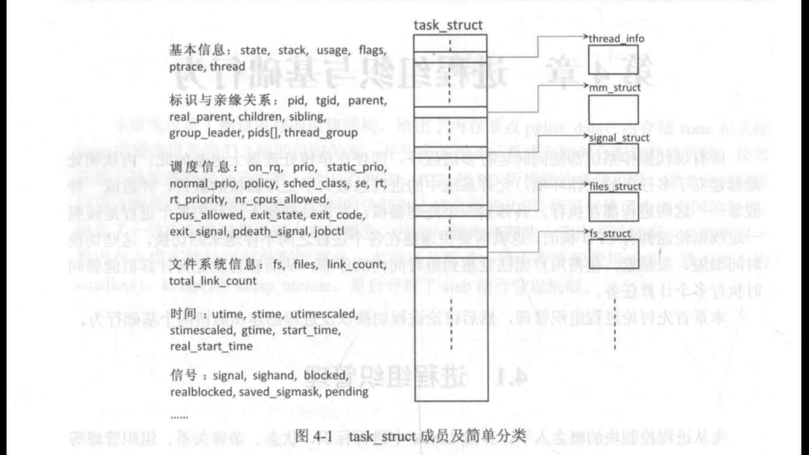
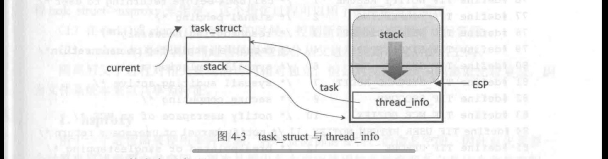
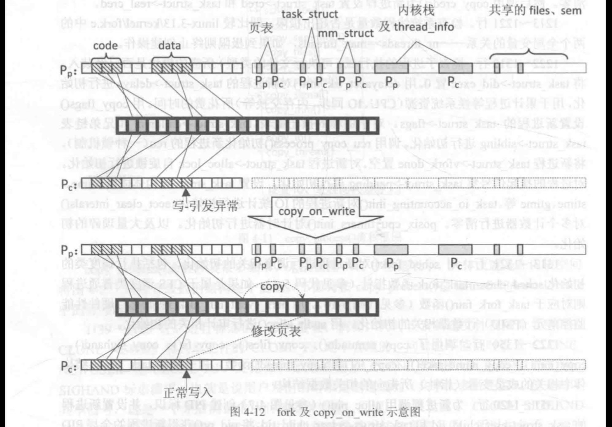
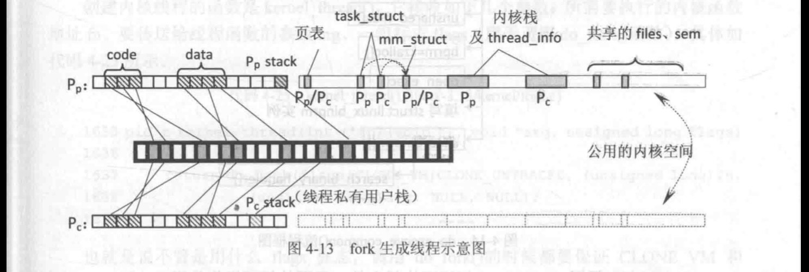
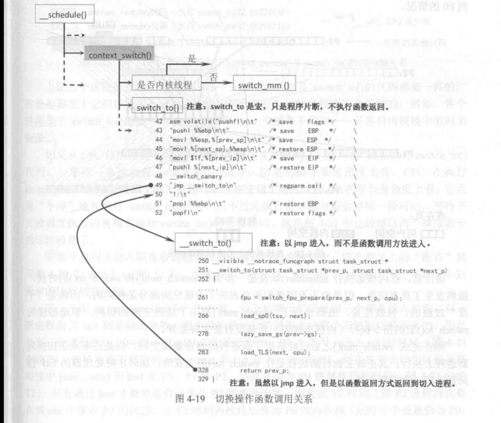

# 进程组织管理

进程控制块 task struct 结构体很复杂，具体如代码 4-36所示。
Linux 内核使用 task struct 描述了进程实体影像，将它绘制出来如图4-2所示。图中展示了进程尸、和P,两个进程，它们各自在内核空间上分配有 task struct 进程控制块。每个进程控制块还指出其内存描述符mm struict,由mm struct 管理进程自己的 VMA(未绘制在图上），再由这些 VMA 管理自己的代码、数据和堆栈等，mm struct 还管理着本进程的页表、堆栈等，读者可以自行回顾进程影像的内容。除此之外，task struct 还管理着进程的资源，例如打开的文件、占用的信号量等。这些信息在存储上都是在一维的内核空间上，但是其抽象的组织却极其复杂。比如马上要讨论的进程 1D 标识题，不是一个简单的编号，而是带有层次性的组织，又比如进程间的关系，通过 task struct 组织成亲缘关系、进程组、会话组等。

task struct 和thread info 的关系如图 4-3 所示。Linux 为每个进程单独地在内核空间分配 task struct 结构，而将这个进程对应的内核栈和 thread info 结构体一并安置在内核空间的连续两个页帧（8192B）中由于 thread info 和内核堆栈的这种联系，使得内核很容易从堆栈指针 ESP 寄存器的值

获得当前进程的 thread info 结构的地址，current thread info0函数如代码 4-2所示-将ESP 的低 12位清零来获得 thread info 的地址。由于更多信息在task struct 中，所以往往利用current 宏取得每 CPU 变量 current task 所指向的当前进程控制块，例如，可以用 current->pid 获得当前 CPU 上运行的进程的全局 PID。

每当进程从用户态转到内核态的时候，需要从用户态堆栈切换到内核态堆栈。因此用户态代码的西数调用层次关系在用户态栈中保存，而进程通过系统调用进入内核代码后的内核函数调用层次关系则在内核栈中体现。刚切换到内核态时该进程内核栈总是空的 (ESP指向栈的顶端），内核态堆栈随内核西数调用和返回而变化。相反地，每次进程从内核态返回到用户态执行的时候其内核态堆栈则是清空的。  

## Fork

图4-12上下分别是刚创建的时候(页表映射关系相同)和发生 copy on write 之后的情形。两个进程中的任意一个对可写页发出写操作的时候（此时页表项权限为不可写，而 vma 描述此段虚存可写），于是将该页帧复制一份，，并改写发出写操作的那个进程的页表映射关系。这样一来两个进程之间共享的可写数据并不需要一开始就全部复制好，而是推迟到真正发生写操作的时候（引发不一致了)。如果这些可写数据并未被修改，那么双方可以安全地共享而无须浪费时间去复制，减少了开销。

如果是创建线程，那么新1日线程都使用相同的进程空间和共享几乎所有的资源，但用户态堆栈等属手私有资源，如图 4-13 所示。要注意除了进程描述符 task struct 和内核栈是各自独立的外，其他的页表、内存描述符mm struct、打开的文件列表等都是共享的。关于各个线程在同一进程影像上的用户态堆栈的不同（Ppstack和P。stack)，可对比图 2-16中关于多线程的视图，此处增加了内核空间的管理数据的细节。

## 进程切换

最核心的操作就是完成进程影像切换的 switch mm0，以及内核堆栈切换和其余硬件环境切换的switch to0两个西数。也就是说切换的核心操作包括以下两个步骤。
（1）切换进程空间：
(2）切换内核堆栈和硬件上下文（从而通过跳转指令，恢复下-进程的执行流)。
可以画出这些西数的调用关系如图 4-19所示。

