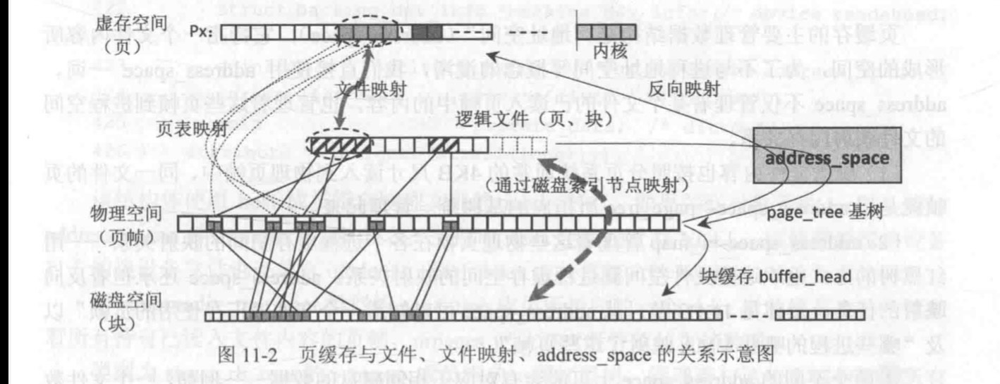
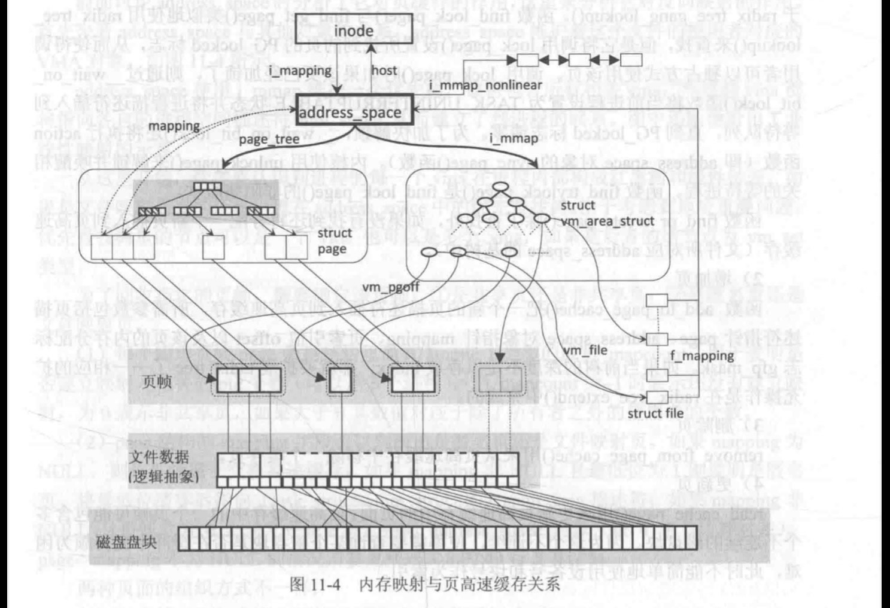
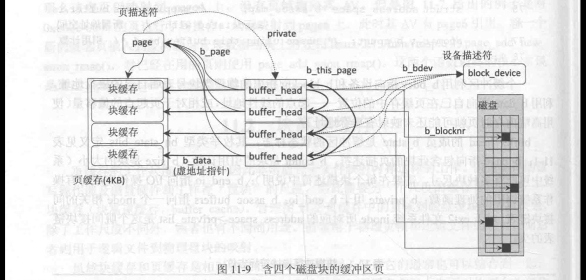

# 页缓存块缓存
## 页缓存

页高速缓存是对一整页文件数据进行操作的磁盘高速缓存。Linux 的页高速缓存涉及的被缓存的页面范围很广泛，和 System V Release 4 引入页高速缓存(仅缓存文件系统数据）不一样，Linux 的页高速缓存任何基于页的数据，所缓存的页面包括普通文件内容、块设备文件和内存映射文件的读写内容，包括以下类型的页。

(1）含普通文件数据的页（可进行读、写或内存映射等操作)。

（2）含目录文件的页（文件系统中目录只是一个内容特殊的普通文件）。

(3）含直接从块设备《跳过文件系统层）读出的数据的页。

(4）含有已被换出到交换分区（交换文件）的用户态进程数据的页，例如，用 malloco分配的空间中的数据。这些页未换出前与文件系统无任何直接关系，换出后解除页表映射并保存到交换分区中，此时页缓存中仍保留有数据直到被回收分配出去

（5）含特殊文件系统文件的页（例如，共享内存的进程通信所使用的特殊文件系统shm),页高速缓存中的每个页所包含的数据是属于某个文件的，这个文件（更准确地说是文件的索引节点）就称作该页的宿主（Owner）。。同一个磁盘上的文件页，可能通过文件打开和块设备打开建立起两个页缓存。  

页缓存中一个页帧的文件数据所对应的磁盘块不必是连续的。如果是普通文件内容，则它们只是在逻辑上连续的磁盘盘块可以不连续，而块设备文件的页缓存则磁盘盘块在物理上也是连续的

页缓存的主要管理数据结构是 “地址空间” (address\_ space)，它特指一个文件内容所形成的空间，为了不与进程地址空间等概念的混淆，我们直接使用 address space 一词。address space 不仅管理着某个文件的已读入页帧中的内容，也管理着这些页帧到进程空间的文件映射内存关系，

（1）磁盘文件内容也按照分页系统通常的 4KB 尺寸读入到物理页帧中，同一文件的页帧就是用address\_ space->page tree 所指向的基树统一管理起来。

(2)address space->i map 管理着这些物理页帧在各个进程虚存空间的映射关系用红黑树的方式组织这些文件空间到进程虚存空间的映射关系。address space 还承担着反向映射的任务，具体见 11.1.3 节。从address\_ space 可以知道一个文件“正在使用的页帧”以及“哪些进程的哪些 VMA 映射了这些页帧”。

两个不同的 address space 上可能会有对应于相同磁盘的数据 例如，一个文件数据通过文件系统打开和使用块设备直接打开时。

一个正在被访问的文件将拥有一个address\_ space 管理对象，即便没有使用者，页缓存
仍然保留，直到物理页帧不足时才被换出。每个address\_ space 必须与一个文件相对应。

(1）一个address space 和一个“文件”相对应，每个文件正在使用的页缓存通过address space 管理起来。如果文件是一个普通数据文件，那么address space 和文件的 inode直接对应，inode 的idata 成员就是这个address space 对象，同时 inode 的imapping 指针指向这个i data 成员。

（2）如果文件代表一个块设备文件，那么它应该和块设备相对应（而不是那个设备节点），因为数据只存在于块设备上。这时 address space 是联入到与该块设各相关的特殊文件系统bdev 中文件的“主”索引节点中(块设备描述符 block device 的bd inode 字段引用这个索引节点)。块设备文件对应的索引节点的 imapping 字段指向主素引节点中的address space 对象，对应地将 address space 对象host 指向主索引节点。因此一个块设备通过多个不同的设备文件来访问的结果仍然是属于同一个块设备的address space。  

## 块缓存

属于同一个文件页的多个块的数据可以保存在同一个缓冲页中，这个缓冲页的描述符page 利用private 成员指向这些块描述符的环状链表。每个块由一个描述符所描述，这些块的描述符本身又利用b this page 指针构成一个环状链表，

